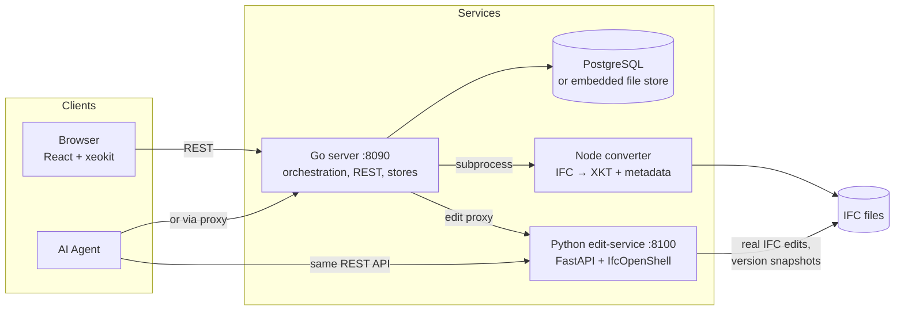

# AI_IFC

[中文说明](README.zh-CN.md)

A self-hosted, open-source **BIM review and editing platform** for IFC models — with real IFC modification, semantic version diffing, and an AI-ready editing API.

AI_IFC lets you upload IFC models in the browser, inspect properties and spatial structure, file issues pinned to 3D elements, **really edit IFC attributes** (not just display overrides), compare model versions with semantic diffs, and expose the **same REST editing API to humans and AI agents** alike.

> Status: working toward a `v0.1.0` open-source release. The platform is functional end-to-end (upload → convert → review → edit → commit → diff); hardening for one-command deployment is on the near-term roadmap.

## Features

**Review**
- IFC upload with queued conversion to xeokit XKT (fast binary geometry + extracted metadata)
- 3D viewer: model tree (search / type filter / visibility), property inspector (pset browsing, search, copy), hide / isolate / X-Ray, section planes, distance measurement, NavCube
- Issues / markups: create with camera state + screenshot, status workflow, 3D pins overlaid on the model, click-to-locate
- Change history: every edit recorded with author, timestamp, old→new values, operation, and provenance (`UI` | `AI`)

**Edit (real IFC modification)**
- Two-phase **pending → commit** editing: changes stage in memory, commit persists atomically
- Direct attributes (`Name`, `Description`, …) and property-set values (`Pset_WallCommon.FireRating`, …)
- Property **overrides** (non-destructive display layer) with one-click migration into real IFC edits
- Every commit creates an immutable **version snapshot** of the IFC file

**Version diff**
- `POST /models/{id}/diff` — semantic diff by **GlobalId**: added / removed / changed with field-level old→new (powered by IfcDiff, attribute-level)
- Diff Viewer in the browser: pick base/target versions, green (added) / red (removed) / yellow (changed) highlighting + property diff list

**AI-ready**
- Humans and AI agents share **one editing API** (provenance distinguishes `UI`/`AI`)
- OpenAPI tool catalog exported from the service, ready to feed to an LLM: [`docs/ai-tools.openapi.json`](docs/ai-tools.openapi.json)
- Integration guide: [`docs/ai-integration.md`](docs/ai-integration.md) — MCP exposure is a planned v1.1 wrapper

## Architecture



- **web** (`viewer/web`) — React 19 + xeokit viewer: review UI, property editor, issue pins, Diff Viewer
- **server** (`viewer/server`) — Go (stdlib + pgx): upload/conversion queue, REST API, edit orchestration, Issue/change/override stores (file or PostgreSQL, switchable)
- **converter** (`viewer/converter`) — Node CLI: web-ifc + xeokit-convert; extracts spatial tree and property sets keyed by GlobalId
- **edit-service** (`viewer/edit-service`) — FastAPI + IfcOpenShell: pending/commit editing, version snapshots, IfcDiff integration

Detailed architecture (Chinese): [`docs/architecture/ai-bim.md`](docs/architecture/ai-bim.md) · Viewer internals: [`docs/architecture/viewer-detail.md`](docs/architecture/viewer-detail.md)

## Quick Start

Prerequisites: Go 1.26+, Node.js 18+, Python 3.10+ with [uv](https://docs.astral.sh/uv/). PostgreSQL is **optional** (file storage works out of the box).

```bash
# 1. Converter deps
cd viewer/converter && npm install

# 2. Edit service (IFC editing / versions / diff)
cd ../edit-service && uv sync
VIEWER_DATA_DIR="$(cd ../data && pwd)" uv run uvicorn app.main:app --port 8100 &

# 3. Go server
cd ../server && go run ./cmd/server &        # serves :8090

# 4. Web UI
cd ../web && npm install && npm run dev      # http://localhost:5173
```

Open http://localhost:5173, upload an `.ifc` file (a sample lives at `viewer/converter/test/fixtures/wall-with-opening-and-window.ifc`), and once conversion finishes: inspect properties, file issues, edit attributes, then open the **Diff** panel to compare versions.

Full usage guide (Chinese): [`docs/usage.md`](docs/usage.md)

### AI agent quick example

```bash
# Same API the UI uses — call the edit service directly (provenance: AI)
curl -X PUT http://127.0.0.1:8100/models/$MID/entities/$GUID \
  -H 'Content-Type: application/json' \
  -d '{"fields":{"Name":"AI-renamed"},"author":"ai-agent","provenance":{"source":"AI"}}'
curl -X POST http://127.0.0.1:8100/models/$MID/commit
curl -X POST http://127.0.0.1:8090/api/models/$MID/edit/diff \
  -H 'Content-Type: application/json' -d '{"base":"v1","target":"current"}'
```

## Repository Layout

```
viewer/            # the BIM platform (web / server / converter / edit-service)
docs/              # architecture, usage, AI integration, open-source plan
research/          # research notes + report↔implementation mapping (overview.md)
src/simplecadapi/  # archived: SimpleCADAPI (SCAD → STEP), the repo's origin
skills/            # archived: SimpleCADAPI skill package
examples/          # archived: SCAD examples (no IFC examples yet)
```

> **Legacy note:** this repository was forked from SimpleCADAPI (OCP-native CAD generation, [paper artifact](docs/legacy/SimpleCADAPI.md)). The SCAD SDK, skills and examples are kept **archived** for reference; active development is the IFC platform under `viewer/`.

## Testing

```bash
cd viewer/server       && go test ./...    # Go: api / stores / queue
cd ../edit-service     && uv run pytest    # Python: editing / versions / diff
cd ../web              && npm test         # web: components / client / store
cd ../converter        && npm test         # converter pipeline
cd ..                  && ./scripts/smoke.sh   # end-to-end (services must be running)
```

## Roadmap

- **Done**: review platform (issues, overrides, history, PG storage) → real IFC editing (pending/commit, versions, IfcDiff, Diff Viewer, AI integration docs)
- **Next (N+3)**: one-command `docker compose up`, CI, license audit, `v0.1.0` release — see [`docs/open-source-plan.md`](docs/open-source-plan.md)
- **v1.1 candidates**: MCP wrapper for the editing API, geometry diff, incremental reconversion
- **Out of scope for v1**: auth/multi-user, AI generation itself (a parallel effort plugs into our API), IFC→Python pipeline, RAG

Iteration plan: [`docs/architecture/roadmap.md`](docs/architecture/roadmap.md)

## License

[AGPL-3.0](LICENSE). A dependency license audit is scheduled before the `v0.1.0` release (see the open-source plan).
