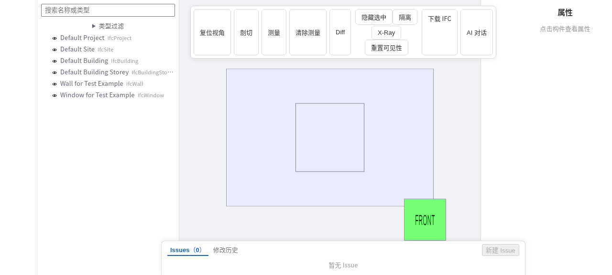
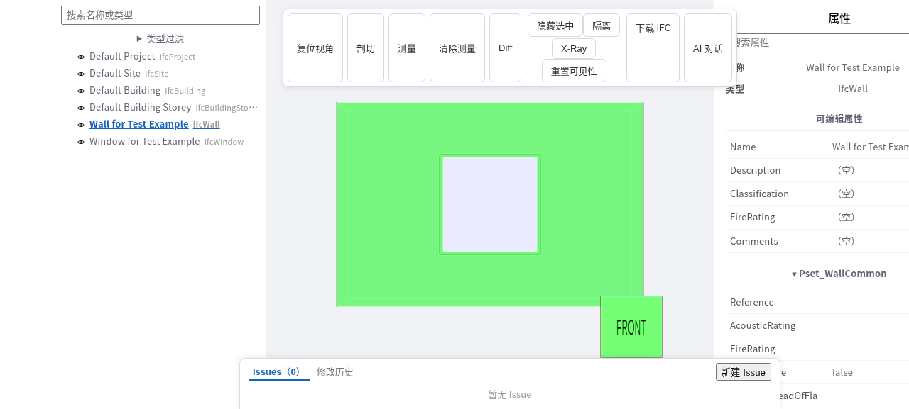
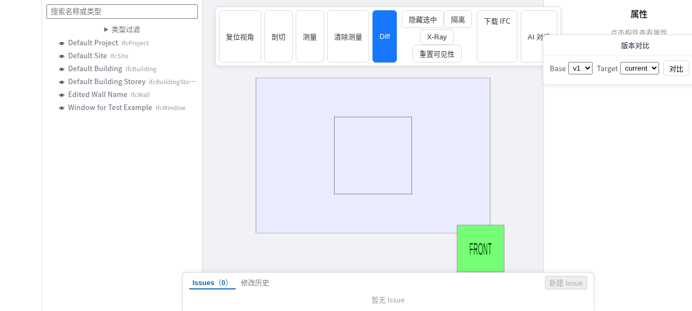
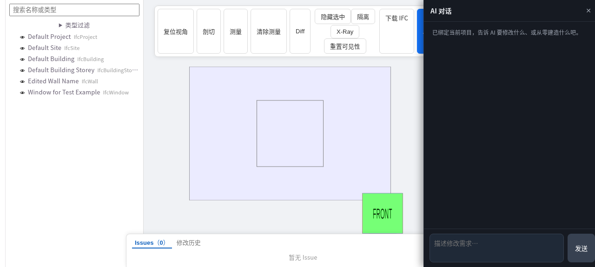

# AI_IFC

[中文说明](README.zh-CN.md)

A self-hosted, open-source **BIM review and editing platform** for IFC models — real IFC modification, semantic version diffing, and an AI-ready editing API shared by humans and agents.

> **Documentation: [https://0702hjj.github.io/AI_IFC/](https://0702hjj.github.io/AI_IFC/)** — quick start, viewer usage, development guide, REST/editing API and AI integration.

## Key Advantages

| | |
|---|---|
| **Real IFC editing** | Override → pending → commit two-stage editing that genuinely rewrites the IFC file; an immutable version snapshot per commit. |
| **Semantic version diff** | Attribute-level diff keyed by GlobalId (added / removed / changed), rendered in the Diff Viewer with old → new detail — no geometry noise. |
| **One API, two roles** | The same REST editing API for humans (via the Go server) and AI agents (direct, with `provenance.source="AI"`). |
| **AI authoring skill** | An agent-agnostic `aiifc` skill lets AI write `ifcopenshell.api` code to build or modify models from natural language. |
| **Self-hosted & open** | AGPL-3.0, four components (web / server / converter / edit-service), file or PostgreSQL storage, single-machine friendly. |

## What it does

- Upload IFC in the browser; review properties, spatial structure, issues and 3D pins.
- Really edit IFC attributes (override → pending → commit), with immutable version snapshots per commit.
- Compare versions with attribute-level semantic diffs (by GlobalId), rendered in the Diff Viewer.
- Expose the same REST editing API to humans (via the Go server) and AI agents (direct, with `provenance.source="AI"`).
- Ship an AI authoring skill (`skills/aiifc/`) so agents can generate or heavily modify IFC models, complementing the REST editing API.

## Architecture

```
Browser (React + xeokit) ──► Go server ──► edit-service (FastAPI + IfcOpenShell)
                                  │                └─ IFC true-edit + version + diff
                                  ├─► converter (Node, IFC → XKT)
AI agent ──► REST editing API ────┘
          └─► aiifc skill (write ifcopenshell.api code directly)
```

## Screenshots

| Model library | 3D viewer |
|---|---|
|  |  |

| Property editing | Version diff | AI chat |
|---|---|---|
|  |  |  |

## Quick start

See [Environment & Local Deployment](https://0702hjj.github.io/AI_IFC/guide/quickstart). Four components: `viewer/web` (React + xeokit), `viewer/server` (Go), `viewer/converter` (Node), `viewer/edit-service` (Python FastAPI + IfcOpenShell).

```bash
cd viewer/converter && npm install
cd ../edit-service && uv sync
VIEWER_DATA_DIR="$(cd ../data && pwd)" uv run uvicorn app.main:app --port 8100 &
cd ../server && go run ./cmd/server &
cd ../web && npm install && npm run dev
```

Open http://localhost:5173 and upload `viewer/converter/test/fixtures/wall-with-opening-and-window.ifc`.

## AI: two complementary routes

| Route | For | Entry |
|---|---|---|
| [REST editing API](https://0702hjj.github.io/AI_IFC/reference/ai) | Fine-grained attribute / pset edits with pending → commit, version and diff | `:8100/models/{id}/...` |
| [AI Skill (aiifc)](https://0702hjj.github.io/AI_IFC/reference/ai-skill) | Building models from scratch / large geometry changes | `skills/aiifc/` — agent writes `ifcopenshell.api` code |

The skill is agent-agnostic (opencode, Claude Code, Cursor, …). Bundle it with:

```bash
python tools/skill_pack_aiifc.py --archive   # produces skills/dist/aiifc.tar.gz
```

## Repository layout

```
AGENTS.md          # human-AI collaboration contract (agent entry point)
viewer/            # active product: the IFC platform (web / server / converter / edit-service)
skills/aiifc/      # AI authoring skill (distributable, agent-agnostic)
tools/             # skill packager (skill_pack_aiifc.py)
docs/site/         # public docs site (VitePress, published to GitHub Pages)
docs/work/         # work-item board (audit, plans, trackable items)
docs/internal/     # internal team docs (not published)
docs/superpowers/  # design specs and implementation plans (process artifacts)
src/               # archived: SimpleCADAPI (SCAD), the repo's origin (frozen)
examples/          # IFC-era example scripts
```

## License

[AGPL-3.0-only](LICENSE) — inherited from the SimpleCADAPI fork and consistent with the AGPL-licensed xeokit stack. Third-party attributions and the archived-code boundary: [NOTICE](NOTICE). The `skills/aiifc/` skill itself declares **LGPL-3.0** (reference docs for the LGPL-licensed IfcOpenShell).
