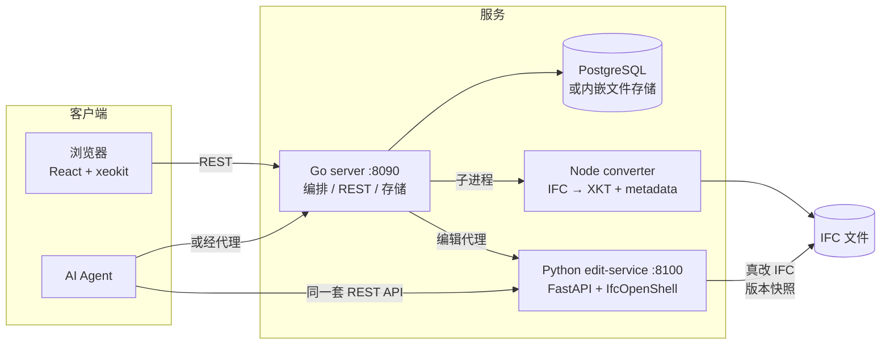

# AI_IFC

[English](README.md)

自托管、开源的 **IFC 模型审查与编辑平台**——真改 IFC、语义化版本对比，以及人/AI 双角色共用的编辑 API。

在浏览器里上传 IFC 模型，查看属性与空间结构、在 3D 构件上钉 Issue、**真实修改 IFC 属性**（不只是显示层覆盖）、用语义 diff 对比模型版本，并且把**同一套 REST 编辑 API** 同时开放给人和 AI agent。

> 状态：正向 `v0.1.0` 开源发布推进。平台已端到端可用（上传 → 转换 → 审查 → 编辑 → commit → diff）；一键部署等工程化在近期的 N+3 迭代。

## 功能

**审查**
- IFC 上传 + 队列化转换为 xeokit XKT（二进制几何 + 提取的语义元数据）
- 3D 查看器：模型树（搜索/类型过滤/显隐）、属性检查器（pset 浏览/搜索/复制）、隐藏/隔离/X-Ray、剖切、距离测量、NavCube
- Issue/批注：带相机状态与截图创建、状态流转、3D 钉覆盖在模型上、点击定位
- 修改历史：每次修改记录 author、时间、old→new、operation 与 provenance（`UI` | `AI`）

**编辑（真改 IFC）**
- **pending → commit** 两阶段：修改先进内存暂存，commit 才原子落盘
- 直接属性（`Name`、`Description`…）与属性集（`Pset_WallCommon.FireRating`…）
- 属性 **override**（非破坏显示层）+ 一键迁移为真实 IFC 修改
- 每次 commit 生成不可变 **版本快照**

**版本对比**
- `POST /models/{id}/diff`：按 **GlobalId** 的语义 diff，added/removed/changed + 字段级 old→new（IfcDiff，属性级）
- 浏览器 Diff Viewer：选 base/target 版本，绿（新增）/红（删除）/黄（修改）着色 + 属性 diff 列表

**AI 可接入**
- 人与 AI 共用**同一套编辑 API**，provenance 区分 `UI`/`AI`
- OpenAPI 工具目录从服务导出，可直接喂给 LLM：[`docs/ai-tools.openapi.json`](docs/ai-tools.openapi.json)
- 接入指南：[`docs/ai-integration.md`](docs/ai-integration.md)；MCP 化为 v1.1 候选

## 架构



- **web**（`viewer/web`）：React 19 + xeokit——审查 UI、属性编辑、Issue 钉、Diff Viewer
- **server**（`viewer/server`）：Go（stdlib + pgx）——上传/转换队列、REST API、编辑编排、Issue/change/override 存储（文件 / PostgreSQL 可切换）
- **converter**（`viewer/converter`）：Node CLI——web-ifc + xeokit-convert，提取以 GlobalId 为键的空间树与属性集
- **edit-service**（`viewer/edit-service`）：FastAPI + IfcOpenShell——pending/commit 编辑、版本快照、IfcDiff

详细架构：[`docs/architecture/ai-bim.md`](docs/architecture/ai-bim.md) · Viewer 内部细节：[`docs/architecture/viewer-detail.md`](docs/architecture/viewer-detail.md) · 团队同步汇报：[`docs/team-sync.md`](docs/team-sync.md)

## 快速开始

依赖：Go 1.26+、Node.js 18+、Python 3.10+（配 [uv](https://docs.astral.sh/uv/)）。PostgreSQL **可选**（默认文件存储零依赖）。

```bash
# 1. 转换器依赖
cd viewer/converter && npm install

# 2. 编辑服务（IFC 编辑 / 版本 / diff）
cd ../edit-service && uv sync
VIEWER_DATA_DIR="$(cd ../data && pwd)" uv run uvicorn app.main:app --port 8100 &

# 3. Go 服务
cd ../server && go run ./cmd/server &        # 监听 :8090

# 4. Web UI
cd ../web && npm install && npm run dev      # http://localhost:5173
```

打开 http://localhost:5173，上传 `.ifc`（样例：`viewer/converter/test/fixtures/wall-with-opening-and-window.ifc`），转换完成后即可查看属性、建 Issue、改属性，再打开 **Diff** 面板对比版本。

完整使用文档：[`docs/usage.md`](docs/usage.md)

### AI agent 调用示例

```bash
# 与 UI 同一套 API —— AI 直连编辑服务（provenance: AI）
curl -X PUT http://127.0.0.1:8100/models/$MID/entities/$GUID \
  -H 'Content-Type: application/json' \
  -d '{"fields":{"Name":"AI-renamed"},"author":"ai-agent","provenance":{"source":"AI"}}'
curl -X POST http://127.0.0.1:8100/models/$MID/commit
curl -X POST http://127.0.0.1:8090/api/models/$MID/edit/diff \
  -H 'Content-Type: application/json' -d '{"base":"v1","target":"current"}'
```

## 仓库布局

```
viewer/            # BIM 平台（web / server / converter / edit-service）
docs/              # 架构、使用、AI 接入、开源方案
research/          # 调研笔记 + 报告↔实现映射（overview.md）
src/simplecadapi/  # 已归档：SimpleCADAPI（SCAD → STEP），本仓库的起点
skills/            # 已归档：SimpleCADAPI skill 包
examples/          # 已归档：SCAD 示例（暂无 IFC 示例）
```

> **遗产说明**：本仓库 fork 自 SimpleCADAPI（OCP 原生 CAD 生成，[论文 artifact](docs/legacy/SimpleCADAPI.md)）。SCAD SDK、skills 与 examples 作为归档保留；活跃开发是 `viewer/` 下的 IFC 平台。

## 测试

```bash
cd viewer/server       && go test ./...    # Go：api / 存储 / 队列
cd ../edit-service     && uv run pytest    # Python：编辑 / 版本 / diff
cd ../web              && npm test         # web：组件 / client / store
cd ../converter        && npm test         # 转换管线
cd ..                  && ./scripts/smoke.sh   # 端到端（需先起服务）
```

## 路线图

- **已完成**：审查平台（Issue、override、历史、PG 存储）→ 真改 IFC（pending/commit、版本、IfcDiff、Diff Viewer、AI 接入文档）
- **下一步（N+3）**：`docker compose up` 一键起、CI、许可证审计、`v0.1.0` 发布——见 [`docs/open-source-plan.md`](docs/open-source-plan.md)
- **v1.1 候选**：编辑 API 的 MCP 包装、几何 diff、增量重转
- **v1 不做**：鉴权/多用户、AI 生成本体（并行线，接入我们的 API）、IFC→Python 管线、RAG

迭代计划：[`docs/architecture/roadmap.md`](docs/architecture/roadmap.md)

## 许可证

[AGPL-3.0-only](LICENSE)——继承自 SimpleCADAPI fork，与 AGPL 的 xeokit 栈一致。三方组件归属与归档代码边界见 [NOTICE](NOTICE)；`v0.1.0` 发布前做全量依赖许可证审计（见开源方案）。
