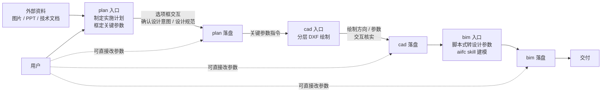
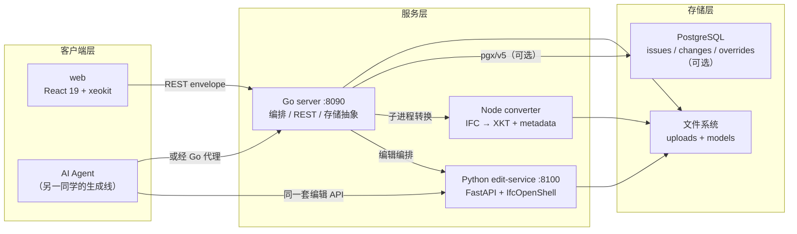
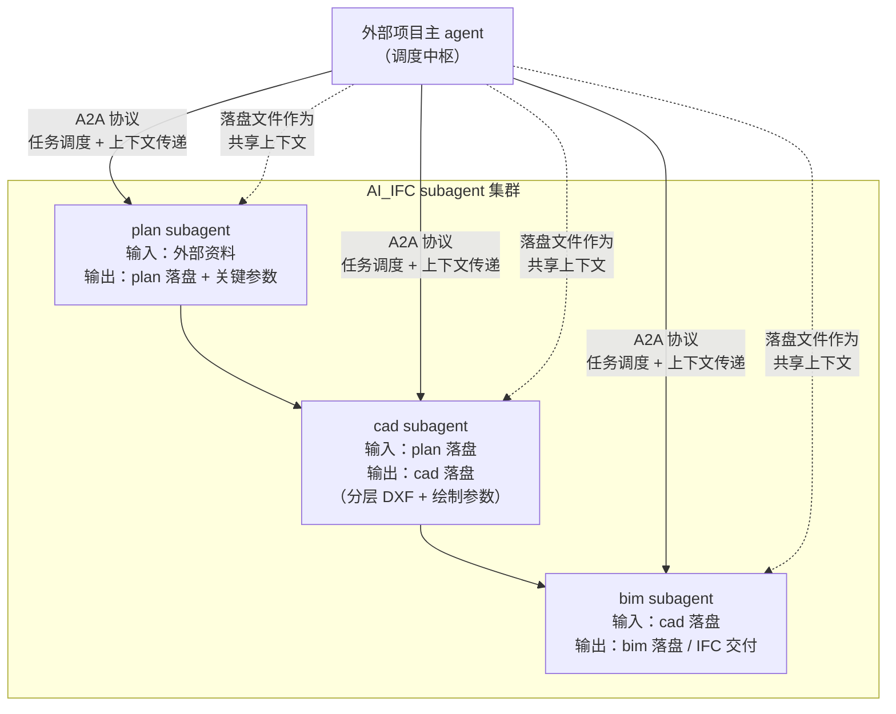

# AI BIM 总体架构：plan / cad / bim 工作流（2026-08-03）

> 本文以 **plan → cad → bim** 三个核心入口为框架，概述 AI_IFC 的总体架构与 AGENT 工作流。
> plan / cad / bim 设计为**可框定的 subagent**，通过 **Agent-to-Agent（A2A）协议**连接到外部项目主 agent，供其按需调用。
> 当前落地体系集中在 bim 入口（五组件审查/编辑平台），plan / cad 为远景扩展。
> 迭代计划见 [roadmap.md](./roadmap.md)；目标↔实现映射见 `research/overview.md`。
> **前端 UI 实现属项目另一成员职责，本文档不规定前端实现。**

## 1. 定位

AI_IFC 是一个**自托管、开源的 IFC 审查与编辑平台**，面向从项目资料到 BIM 产物的**三阶段 AGENT 生成管线**：

- **plan**：外部资料对接接口，解析归一化输入，框定设计意图与关键参数
- **cad**：基于 plan 分层绘制 DXF，交互确认后落盘
- **bim**：对接 aiifc skill，完成最终建模交付

plan / cad / bim 三者设计为**可框定的 subagent**——各自有清晰的输入/输出契约（落盘文件），通过固定工作流串联。三者作为独立能力模块，通过 **Agent-to-Agent（A2A）协议**连接到**外部项目主 agent**，由主 agent 按需调度调用，以落盘文件作为上下文传递载体（详见 4.5 节）。

当前版本（v1）的取舍：
- **我们做**：IFC 显示 + 版本追踪/存储 + 供 AI 接入的双角色编辑架构
- **另一同学做**：AI 生成本体、AI 沙箱、IFC→Python 工具——经我们交付的接口接入
- **v1 不做**：鉴权/多用户、Git 存 IFC、RAG

## 2. 总体流程

## 3. 三条工作线

| 工作线 | 状态 | 说明 |
| --- | --- | --- |
| 1. AI 生成 IFC 的 skill | 另一同学负责 | 调研已备（`research/ifc/`）；接入走双角色编辑 API，MCP 化 v1.1 候选 |
| 2. Viewer（五组件审查/编辑平台，即 bim 当前体系） | **N+2 完成** | 本文档 4.3 节详述；五个组件端到端可用 |
| 3. 后端 DB 集成 | viewer 侧已落地 | issues / changes / overrides 三表 File / PG 双实现 |

## 4. plan / cad / bim 入口分述

### 4.1 plan 入口（外部对接 + 关键参数框定）

plan 是整条管线的**外部资料对接接口**，负责把异构输入归一为下游可执行的结构化实施方案。

- **外部资料对接**：接收项目外部的图片、PPT 方案、项目技术文档等，解析归一化，不臆造、不丢失原始约束。
- **关键参数框定**：明确框定供下游 cad / bim 参考的关键参数，至少包括：
  - 建筑层数（每层后续由 cad 单独绘制）
  - 建筑类型（住宅 / 办公 / 商业 / 公建等，决定绘制与建模范式）
  - 其余由 plan skill 约定的设计意图与设计规范要素
- **交互确认**：以**选项框式交互**与用户确认设计意图和设计规范，必须经人核实后才定稿。
- **落盘**：定稿后写入 `plan`（单一事实来源）；关键参数即下游 cad 的指令基准。
- **待封装**：后续沉淀为独立的 **plan skill**（解析外部资料 + 框定关键参数 + 选项框交互流程）。

### 4.2 cad 入口（精准接收 + 绘制方向交互 + skill 封装）

cad 依据 plan 对**每层 DXF 单独绘制**，强调对上游指令精准承接与绘制方向人工确认。

- **精准接收上游**：精准接收 plan 的指令（层数拆层、建筑类型对应绘制范式），作为硬约束。
- **绘制方向交互**：以高效交互确认 cad 绘制的方向参考——平面布局取向、轴网 / 开间进深策略、功能分区组织等。绘制方式与参数也需交互核实后才落盘。
- **待封装 skill + 参考映射**：cad 的绘制能力需沉淀为**独立的 cad skill**，并建立**大类精品 cad 设计参考的映射**——按建筑大类把高质量设计范式整理为可复用参考库。
- **落盘**：定稿后写入 `cad`（单一事实来源）。
- **v2 管线契约**：cad 侧 v2 设计（layout.json 事实源 / DXF 工程产物 / 同步桥）已定稿，见 [ai-cad-v2-contract.md](./ai-cad-v2-contract.md)。

### 4.3 bim 入口（当前体系 + 适配化改造）

bim 承接 cad 产出 IFC 交付物。它由两部分组成：当前已落地的五组件审查/编辑平台，以及面向三阶段流程的适配化改造。

**4.3.1 当前 bim 体系（五组件，N+2 完成）**

| 组件 | 技术 | 职责 |
| --- | --- | --- |
| web | React 19 + TS + Vite + zustand + xeokit-sdk | 审查 / 编辑 / Diff 全部交互 |
| server | Go（stdlib net/http + pgx/v5） | 上传 / 转换队列、REST、编辑编排、存储抽象（File / PG 双实现） |
| converter | Node CLI（web-ifc + xeokit-convert） | IFC → XKT 几何 + 语义提取（空间树 / pset，GlobalId 为键） |
| edit-service | Python 3.10 + FastAPI + ifcopenshell + ifcdiff | 真改 IFC、版本快照、语义 diff |
| PG | PostgreSQL（可选） | issues / changes / overrides 三表；不配置则全部落文件 |

三语言并存是**生态现实**而非设计偏好——每个组件绑定了该生态里唯一或最优的 IFC 库，通过 REST 与子进程解耦。

**4.3.2 核心数据流概览**

**上传转换流**：浏览器上传 .ifc → Go 校验存盘 → 转换队列 node convert.js → 产出 `model.xkt`（几何）+ `metadata.json`（空间树/属性，GlobalId 为键）→ 前端加载。关键不变量：XKT 构件 id = metadata id = IFC GlobalId，选中/着色/diff 靠此对齐。

**编辑流**：属性编辑提交后暂存为 pending（内存态），commit 时原子写盘 + 版本快照 + 追加编辑历史 → 重转 XKT → 前端轮询自动重载。pending 重启丢失（v1 限制），并发由「每模型一把锁」串行化。

**版本与 diff 流**：每次 commit 快照 `versions/v{n}.ifc`（线性序列，只增不改）。IfcDiff 按 GlobalId 对齐给出 added / removed / changed，适配层补充字段级 old / new。Diff Viewer 按 added（绿）/ changed（黄）/ removed（红列表）着色展示。

**override → 真改迁移**：早期显示层 override（不改 IFC 本体）可批量迁移为真改——回放全部 override → 每 entity 一次 PUT → 全部一次 commit。

**4.3.3 双角色 API 与 AI 接入**

- **人**：浏览器 → Go 代理 → edit-service；编排附带 change log + 自动重转
- **AI**：REST 直连 edit-service 或经 Go 代理，**同一套端点**；`provenance.source="AI"` 标记来源
- **工具目录**：`docs/site/public/ai-tools.openapi.json`（FastAPI 导出，脚本再生成，保证文档与实现不漂移）+ `docs/internal/ai-integration.md`（端点目录、curl 全流程）
- **MCP**：v1 REST 先行，MCP 薄包装列 v1.1
- **认证**：v1 单机自托管不做；provenance 为声明字段

**4.3.4 偏差记录（当前阶段决策）**

1. **前端栈**：选 web-ifc + xeokit-convert（非 IfcOpenShell WASM）；IfcOpenShell 的符合度由后端 edit-service 承担
2. **存储**：DB 半已落地，Git 暂缓
3. **oldValue**：真改阶段起一律为 IFC 真原值
4. **几何 diff**：v1 限定属性级（几何 diff 计算量与语义噪声）

**4.3.5 边界与技术债**

**v1 不做**：鉴权、Git 存 IFC、RAG、几何 diff、增量重转。

**已知技术债（按优先级）**：三份历史（Go change.Store / edit-history.json / 内存 pending）→ v2 归并单源；ifcdiff 本地依赖已解决（2026-08，全切 PyPI）；pending 重启丢失 → v2 持久化；diff 无超时控制 → N+3。

**4.3.6 适配化改造方向（远景）**

现有 `skills/aiifc/`（ifcopenshell.api）需面向本流程做适配：
- 输入契约从"独立设计 JSON"扩展为"消费 cad 落盘产物"，复用骨架 / 容器 / placement / pset / design 流程与自检机制
- bim 入口以**脚本式转换**把 cad 的几何 / 布局信息提炼为**设计参数参考**（design parameter reference），再由 ifcopenshell.api 建模——转换是确定性、可重放的脚本

### 4.4 参数可改与 AGENT 统一加载约定

- plan / cad / bim 三处用户**均可直接修改参数**
- **AGENT 每次开工统一加载这三处**作为唯一输入，不读取中间临时态、不依赖会话内存
- 任何阶段的修正通过改落盘文件生效，AGENT 重跑即采纳

### 4.5 plan / cad / bim 作为可框定 subagent 与 A2A 协议联络（远景）

plan / cad / bim 三者的远景定位不是三个 UI 页面，而是**三个可框定的 subagent**——各自有独立的输入/输出契约、工作边界和能力封装，通过 A2A 协议对外暴露。

**subagent 的"可框定"含义**：

- **输入/输出契约明确**：每个 subagent 的输入和输出都是其对应的落盘文件（plan / cad / bim），接口标准化，不依赖内存态或会话上下文。
- **工作边界独立**：plan 只管意图与规范框定，cad 只管分层绘制，bim 只管建模交付。任一 subagent 可独立替换或升级。
- **交互嵌入 subagent 内部**：每个 subagent 的内部仍然走选项框式人机交互确认流程（见 4.1-4.3 节），用户核实是 subagent 工作流的一部分，不暴露给主 agent。

**A2A 协议联络**：

- plan / cad / bim 作为能力模块，通过 **Agent-to-Agent（A2A）协议**挂载到**外部项目主 agent**。
- 主 agent 按需调度——可只调用 plan 做方案框定，或串联 plan→cad→bim 走完整管线。
- 上下文传递以落盘文件为载体：主 agent 将上游产物写入对应 subagent 的输入位，subagent 完成后更新落盘文件，主 agent 读取下一阶段的输入。
- 用户可在任一方位直接修改落盘文件，跨 agent 生效——AGENT 统一加载约定（见 4.4 节）对主 agent 同样成立。

## 5. 后续 skill 化工作

本管线落地依赖以下 skill 侧封装（排期并入 [roadmap.md](./roadmap.md)）：

| 工作项 | 归属 | 说明 |
| --- | --- | --- |
| plan skill | plan | 解析图片 / PPT / 技术文档，框定关键参数，选项框交互确认设计意图与规范 |
| cad skill 封装 | cad | 分层 DXF 绘制能力独立封装；精准接收 plan 指令，绘制方向与参数交互核实 |
| 大类精品 cad 设计参考映射 | cad | 按建筑大类沉淀高质量设计范式为可复用参考库 |
| aiifc skill 适配化改造 | bim | 扩展输入契约以消费 cad 产物；脚本式 cad → 设计参数参考转换 |

## 6. 路线

- **N+3（进行中）**：docker compose 一键起、README/文档、CI、LICENSE 审计、v0.1.0 发布
- **v1.1 候选**：MCP 包装、几何 diff、增量重转
- **v2 及后续**：多用户 / 鉴权 / 冲突合并、历史单源化、IFC→Python 管线；plan / cad / bim 远景落地——plan skill / cad skill 封装 + 参考映射 / aiifc skill 适配化改造
