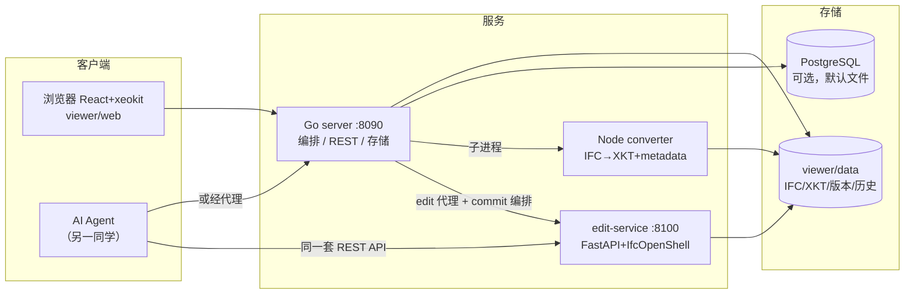

# 技术路线与当前方案（团队同步，2026-07-30）

> 一页读懂 AI_IFC 现在的技术路线、已实现方案、验证证据和下一步分工。
> 深入阅读：总体架构 [architecture/ai-bim.md](architecture/ai-bim.md) · viewer 细节 [architecture/viewer-detail.md](architecture/viewer-detail.md) · 迭代计划 [architecture/roadmap.md](architecture/roadmap.md) · AI 接入契约 [ai-integration.md](ai-integration.md)

## 〇、一页速览

- **是什么**：自托管、开源（AGPL-3.0）的 IFC 审查 + 编辑平台。浏览器上传 IFC → xeokit 3D 审查（Issue/属性/剖切/测量）→ **真改 IFC**（pending/commit 两阶段）→ 版本快照 + GlobalId 语义 diff → 人和 AI 共用同一套 REST 编辑 API
- **现在能干什么**：端到端全部打通并验证（上传→转换→审查→编辑→commit→重转刷新→diff 可查；AI 用 REST 直连完成同样操作）
- **证据**：四套测试全绿（Go 8 包 / pytest 38 / vitest 98 / converter）+ smoke 端到端（含 edit-flow）+ 真机浏览器验证（Diff 着色、old→new 列表）
- **分工**：本平台（viewer 线）= 我们；AI 生成本体 = 另一同学，经 §五 的接口契约接入

## 一、技术路线：关键选型与理由

| 决策 | 选择 | 理由 | 放弃的方案 |
| --- | --- | --- | --- |
| 前端 IFC 展示 | web-ifc + xeokit（XKT 二进制） | IfcOpenShell WASM 启动重，不适合生产前端；XKT 加载快一个数量级，几何/语义解耦 | IfcOpenShell WASM、three.js 自建 |
| 真改 IFC / diff | 后端 IfcOpenShell Python 服务 | IFC 编辑的事实标准只有 C++/Python 形态；前端 WASM 方案排除 | 前端直接改、Go 重写 IFC 解析 |
| 后端语言 | Go（编排）+ Node（转换）+ Python（编辑） | 各取生态唯一解：xeokit-convert 是 npm 包、ifcopenshell 是 Python 库、编排层原有代码是 Go | 统一单语言（代价是放弃某个生态） |
| 属性编辑 | 先 override 后真改（两阶段） | override 不动 IFC 本体，快速跑通「改→记→看」闭环；真改涉及写盘+重转，复杂度高一个量级 | 一步到位直接真改 |
| 版本追踪 | DB + 文件快照（线性版本链） | PG 三表（issues/changes/overrides）+ 每次 commit 存 `versions/v{n}.ifc` | Git 存 IFC（SPF step-id 噪声，暂缓） |
| diff 范围 | 属性级（GlobalId 语义） | 几何 diff 网格重编号、语义噪声大、计算贵；v1 场景是属性编辑 | 全量 IfcDiff（几何 diff 留待按需） |
| AI 接入 | REST 先行 + OpenAPI 工具目录 | 零新组件得到可喂 LLM 的契约；MCP 是薄包装（v1.1） | 直接实现 MCP |
| 部署形态 | 自托管 docker compose（N+3 交付），单机无认证 | v1 定位内网/个人；鉴权/多用户改变整个信任模型，属 v2 | SaaS / 多租户 |

与 deep-research-report（愿景层）的逐项映射与偏差记录：[research/overview.md](https://github.com/0702hjj/AI_IFC/blob/main/research/overview.md)、[architecture/ai-bim.md](architecture/ai-bim.md) §七。

## 二、当前架构



**关键不变量**：`XKT 构件 id = metadata metaObject id = IFC GlobalId`——选中、着色、diff 全靠这条链对齐。

四条核心数据流（上传转换 / pending-commit 编辑 / 版本 diff / override 迁移）详见 [architecture/ai-bim.md](architecture/ai-bim.md) §四。

## 三、核心方案要点

### 3.1 pending → commit 两阶段编辑
- `PUT /models/{id}/entities/{guid}`：全字段校验（任一不合法 → 422 **零副作用**）→ 应用到内存模型 → 记 pending（含**真原值 oldValue**）→ 磁盘不变
- `POST /commit`：原子写盘（tmp+rename，每模型一把锁）→ 版本快照 `v{n+1}.ifc` → 写 history → 清 pending
- 经 Go 代理的 commit 继续编排：change log 按字段展开（operation + IfcDiff 补充 diff）→ 触发 XKT 重转 → 前端轮询到 ready 自动重载
- `DELETE /pending` 回滚；pending 在内存，重启丢失（文档化限制）

### 3.2 版本快照与语义 diff
- 首次 commit 前存 `v1.ifc`（原始上传态）；快照只增不改 → diff 结果可缓存
- `POST /diff {base,target}` → `{added, removed, changed:[{guid, changes:[{field,old,new}]}]}`：IfcDiff 做增删集合与变更门控，适配层 `get_info()`+`get_psets()` 算字段级 old/new
- Diff Viewer：绿=新增、黄=修改（点击定位）、红=删除（当前 XKT 无几何，仅列表——设计决策）

### 3.3 override → 真改迁移
- override = 不改 IFC 的显示层（白名单五字段），至今的存量编辑都在这层
- `POST /api/models/{id}/overrides/migrate`：逐条回放为真改（FireRating 自动反查所在 pset）→ 成功清 override、按真原值写 `operation=migrate` 记录；**失败条目保留 override 并在响应里带原因**——迁移冲突（IFC 原值已被外部改动）不静默覆盖

### 3.4 change log / commit 模型
`{entityId, field, oldValue, newValue, author, provenance{source:UI|AI}, operation:update|migrate, diff, createdAt}`，File/PG 双实现，provenance API 层枚举校验。对齐报告 §1.1 完整 schema。

## 四、验证与完成度

| 层 | 内容 | 状态 |
| --- | --- | --- |
| 单元/集成 | Go（api/三 store/队列，-race）· pytest 38（编辑/版本/diff/锁）· vitest 98 · converter | ✅ 全绿 |
| 端到端 smoke | 上传→转换→Issue CRUD→override→**edit-flow（PUT→pending→commit→change log→重转 ready→diff 含该实体）** | ✅ 通过 |
| 真机浏览器 | Diff Viewer 着色 + old→new 列表（截图验证） | ✅ 通过 |
| AI 角色验证 | REST 直连：PUT（provenance=AI）→commit→versions→diff，oldValue 为 ifcopenshell 重开文件读出的真原值 | ✅ 通过 |
| roadmap 验收条款 | 「浏览器改属性→真改→重转刷新→diff 可查；AI 可完成同样操作；双模式测试全绿 + 真机验证」 | ✅ 全部满足 |

**Live demo 路径**（5 分钟可复现）：
```bash
# 起服务后（docs/internal/usage.md §二）
# 1. 上传 viewer/converter/test/fixtures/wall-with-opening-and-window.ifc
# 2. 经 Go 代理改个 Name 并 commit：
MID=<上传返回的id>; GUID=$(curl -s localhost:8090/models/$MID/metadata.json | python3 -c 'import sys,json;print([o["id"] for o in json.load(sys.stdin)["metaObjects"] if o.get("type")=="IfcWall"][0])')
curl -X PUT localhost:8090/api/models/$MID/edit/entities/$GUID -H 'Content-Type: application/json' -d '{"fields":{"Name":"live-demo-wall"}}'
curl -X POST localhost:8090/api/models/$MID/edit/commit
# 3. 等状态回 ready（前端自动刷新），打开 Diff 面板：base=v1 target=current → 墙变黄 + Name old→new
```

## 五、给 AI 生成线的接口契约（重点）

**接入方式**：与 UI 同一套 REST 编辑 API，两条路径——

| 路径 | 端点前缀 | 说明 |
| --- | --- | --- |
| 经 Go 代理（推荐默认） | `:8090/api/models/{id}/edit/*` | 完整链路：change log + 重转 + 前端自动刷新 |
| REST 直连 edit-service | `:8100/models/{id}/*` | 适合批量/工具内嵌；**注意 commit 不触发 Go 编排**（无 change log、无重转） |

**契约要点**：
1. 每次 PUT 带 `author` 与 `provenance.source="AI"`（枚举校验，其他值 400/422）
2. 修改是 pending/commit 两阶段：PUT 不落盘，commit 才生效并产生版本；丢弃用 `DELETE pending`
3. 字段分两类：`fields`（直接属性，如 Name）与 `psets`（属性集，需显式 pset 名，如 `{"Pset_WallCommon":{"FireRating":"F60"}}`）；校验失败整请求零副作用
4. commit 可带 `{"operation":"update"|"migrate"}`；GET history 拿真原值 oldValue
5. 工具目录：`docs/site/public/ai-tools.openapi.json`（可直接喂 LLM；变更后用 `viewer/edit-service/scripts/export_openapi.py` 再导出）；接入指南 `docs/internal/ai-integration.md`
6. **MCP**：v1.1 候选，薄包装这套 REST（参考 ifcmcp 31 工具模式）；AI 沙箱/代码执行属你们侧，架构不阻塞

## 六、已知限制与技术债（诚实清单）

1. 无认证/多用户（v1 定位单机自托管；provenance 是声明字段，不防伪）
2. pending 内存态，edit-service 重启丢失
3. 三份历史（Go change.Store / edit-history.json / 内存 pending）——已出现并修复过一次 operation 漂移，v2 归并单源
4. ifcdiff 本地 editable 依赖（`../IfcOpenShell`）——N+3 改 vendor/git source + LICENSE 审计
5. diff 属性级、无超时（大模型阻塞 threadpool）；重转全量（增量后续）
6. 大模型性能未基准测试（真机验证为 MB 级样例）——roadmap 风险节已列

## 七、下一步

**N+3（开源就绪，方案已细化：[open-source-plan.md](open-source-plan.md)）**
1. ifcdiff 依赖处理 + LICENSE 审计（维持 AGPL-3.0：SCAD fork 继承 + xeokit 同为 AGPL，论证见方案 §二）
2. docker compose 一键起（server/web/PG/edit-service/converter，干净机器验收）
3. CI（GitHub Actions 六 job：go/python/web/converter/PG/smoke）
4. v0.1.0 发布（tag + release notes + 示例模型）

**分工建议**：我们侧按上表推进 N+3；AI 生成线可按 §五 契约开始对接（建议先用经 Go 代理路径跑通「AI 改一面墙 → 前端自动刷新」的 demo）。v1.1 候选：MCP 包装、几何 diff、增量重转；v2：多用户/鉴权/冲突合并（版本快照 + GlobalId diff 已备地基）。
